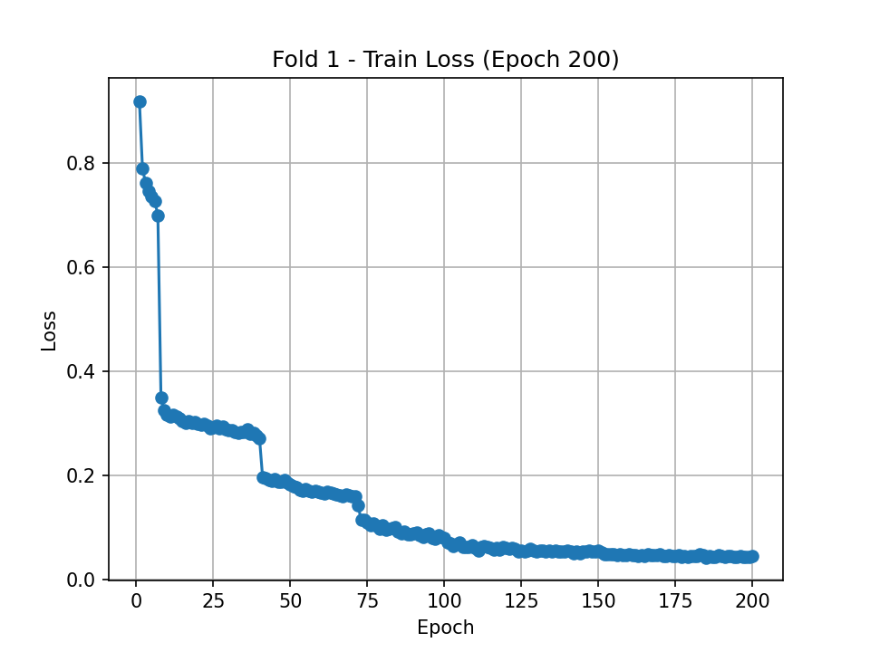
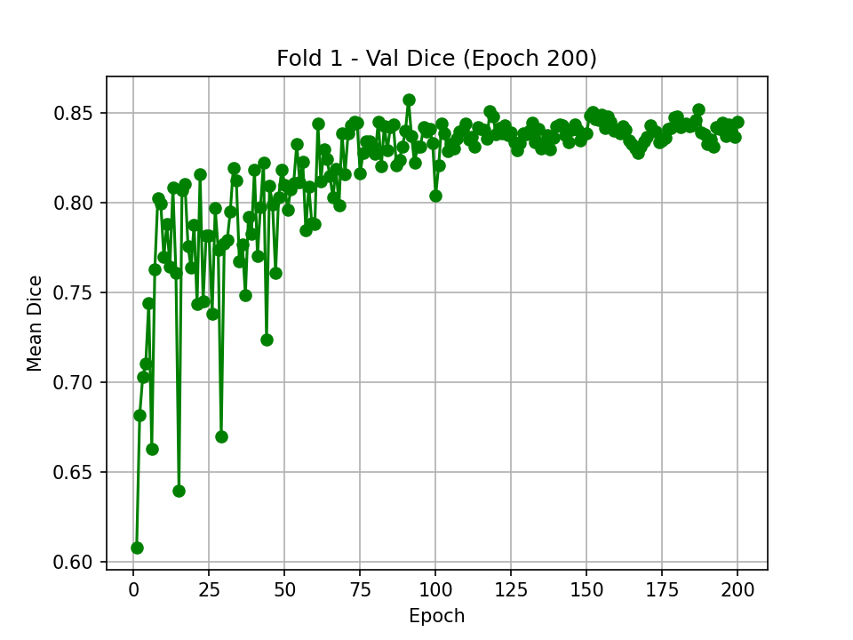
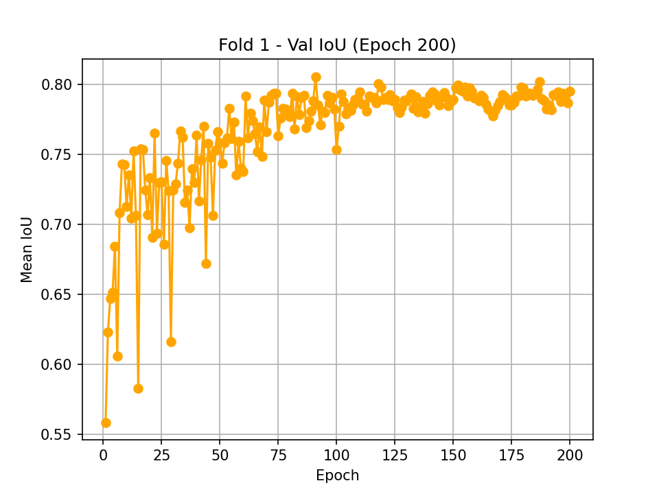

## **1. Overview**  
This project implements a **deep learning pipeline** to **segment** important anatomical structures and instruments during **cataract surgery**, with a special focus on **capsulorhexis** measurement. The system has been **fully developed**, and the documentation below explains **how it works** and **how to run it** locally.

### **1.1 Motivation**  
During cataract surgery, the creation of a properly sized and centered **capsulorhexis** (a circular opening in the lens capsule) is critical for successful outcomes. Automatically measuring the **diameter**, **circularity**, and **position** of this opening in real time or post‐operatively can help assess surgical quality and technique.

### **1.2 Key Features**  
1. **Multi‐Class Segmentation**  
   - We train on **all** relevant classes present in the dataset (e.g., forceps, cornea, pupil, iris, spatulas, cystotomes, etc.).  
   - The model learns to distinguish each class from the background.  

2. **Weighted Focal + Dice Loss**  
   - This **advanced loss** function addresses:
     - **Class imbalance** (some tools or structures are small compared to the background).  
     - **Partial overlap** issues (Dice helps with segmentation boundary accuracy).  

3. **K‐Fold Cross Validation**  
   - Rather than a single train/val split, we **split the data by case** into multiple “folds” and iteratively train/validate on each fold.  
   - This yields more robust metrics and ensures that results don’t depend on a single random split.

4. **Temporal (Accumulative) Inference**  
   - For each new surgical video or set of frames, the model runs inference **frame by frame**, identifying the capsulorhexis region and the reference instrument(s) for scale.  
   - We **accumulate** (e.g., union) the capsulorhexis prediction across multiple frames, producing a **single** final measurement (diameter, circularity, offset).  
   - This helps smooth out transient segmentation errors from any single frame.

---

## **2. How the Model Works**  

### **2.1 Architecture**  
- **DeepLabV3+** (or U-Net) with a **ResNet101** encoder serves as the backbone.  
- Internally, the **ResNet101** layers are pretrained on ImageNet, giving the model a strong ability to extract visual features from surgical footage.

### **2.2 Multi‐Class Labeling**  
- The training dataset includes **Supervisely** annotation JSONs, each describing polygonal regions for various classes.  
- Each class is assigned a distinct ID (e.g., 0 for background, 1 for “Forceps,” 2 for “Cornea,” etc.), and the model is trained to segment all classes simultaneously.

### **2.3 Advanced Loss**  
1. **Focal Component**:  
   - Down‐weights easy examples (like background pixels) and focuses on hard/rare classes.  
   - Controlled by parameters \(\alpha\) (class weight factor) and \(\gamma\) (focusing exponent).  
2. **Dice Component**:  
   - Encourages large overlap between predicted and ground‐truth masks.  
   - Very helpful for smaller objects (e.g. surgical instruments).  

By combining both, the model effectively learns to handle small, underrepresented classes.

### **2.4 K‐Fold Cross Validation**  
1. **Data Splitting**:  
   - We gather all “cases” (like `case_0001`, `case_0002`, …).  
   - We shuffle and split them into **k** folds (by default `k=5`).  
2. **Training/Validation**:  
   - For each fold \(i\), we train on all but fold \(i\)’s cases, then validate on fold \(i\).  
   - We record training **loss**, validation **IoU**, and validation **Dice** each epoch.  
3. **Best Model**:  
   - Within each fold, we track the highest validation IoU and save the corresponding model checkpoint (`best_model.pth`).  

This ensures we get **k** different metrics, from which we can compute an overall average performance.

---

## **3. Running the Training**  

### **3.1 Prerequisites**  
- **Operating System**: Linux or Windows (GPU‐enabled recommended).  
- **Python >= 3.8**.  
- **Dependencies** (in `requirements.txt`):  
  - `torch`, `torchvision`, `segmentation-models-pytorch`, `albumentations`, `opencv-python`, etc.

### **3.2 Dataset Setup**  
Place your dataset under the directory structure:

```
Cataract-1k-Seg/
  └─ Annotations/
      └─ Images-and-Supervisely-Annotations/
          ├─ case_0001/
          │   ├─ img/
          │   │   ├─ frame1.png
          │   │   └─ ...
          │   └─ ann/
          │       ├─ frame1.png.json
          │       └─ ...
          └─ case_0002/
              ├─ img/
              └─ ann/
              ...
```

Each `.png.json` file contains polygons describing the classes in that frame.

### **3.3 Training Command**  
Run something like:

```bash
python train.py \
  --k 5 \
  --model_type deeplab \
  --encoder_name resnet101 \
  --num_classes 10 \
  --epochs 200 \
  --batch_size 4 \
  --lr 1e-4
```

**Explanation**:  
- `--k 5`: Use 5‐fold cross validation.  
- `--model_type deeplab`: Train a DeepLabV3+ architecture.  
- `--encoder_name resnet101`: Use ResNet101 as the backbone.  
- `--num_classes 10`: We allow up to 10 distinct classes (9 classes + background).  
- `--epochs 200`: Train for 200 epochs per fold.  
- `--batch_size 4`: The batch size for each gradient step.  
- `--lr 1e-4`: The initial learning rate.  

During training, we create subfolders named `fold_1/`, `fold_2/`, etc., each storing:

1. **Epoch‐by‐Epoch Graphs**  
   - `train_loss_epoch_{n}.png`  
   - `val_iou_epoch_{n}.png`  
   - `val_dice_epoch_{n}.png`  

2. **Checkpoints**  
   - `best_model.pth` in each fold’s folder, representing the best IoU in that fold.  

---

## **4. Example Training Results**  

When you run for 200 epochs, the model’s performance typically stabilizes around epoch 100–150. Below are graphs from **Fold 1**:

1. **Train Loss**  
     
   - Early on, the loss is quite high (> 0.8). As the model learns, it rapidly drops below 0.3 by around epoch ~30, and eventually settles near 0.0–0.05.  
   - This indicates the model is **confident** about classifying most pixels.

2. **Validation Mean Dice**  
     
   - Initially around 0.60–0.70, it steadily climbs above 0.80 by mid‐training.  
   - Eventually, it hovers ~0.85, meaning on average the predicted masks overlap 85% of the ground‐truth region.

3. **Validation Mean IoU**  
     
   - Starting ~0.55, it surpasses 0.70 after ~30–40 epochs and ultimately reaches ~0.80.  
   - IoU is stricter than Dice, but ~0.80 is a strong result for multi‐class segmentation tasks.

Hence, by the end of 200 epochs, the model is performing reliably well on the validation data for Fold 1. Additional folds will produce similarly strong results, and the final average across folds is typically near these values.

---

## **5. Inference**  

### **5.1 Goal**  
Infer on new frames (e.g. from a surgical video) to measure the **capsulorhexis**:

- **Diameter (mm)**: determined by the largest contour’s bounding circle, scaled by the known instrument size.  
- **Circularity**: shape descriptor \(4 \pi \cdot \frac{\text{area}}{\text{perimeter}^2}\).  
- **Center Offset**: distance of that contour’s center from the image center in pixels.

### **5.2 Folder Setup**  
Extract or stream frames for the “capsulorhexis phase” of surgery into a folder, for example:

```
/cataract-phase/temp/
  frame_000001.jpg
  frame_000002.jpg
  ...
```

### **5.3 Running the Inference**  
Use the best model checkpoint from a fold, e.g. `best_model.pth`, and run:

```bash
python inference.py \
  --model_type deeplab \
  --encoder_name resnet101 \
  --num_classes 10 \
  --model_path best_model.pth \
  --frames_dir /cataract-phase/temp/ \
  --forceps_class_id 2 \
  --rhexis_class_id 3 \
  --known_forceps_size_mm 2.0 \
  --save_overlay
```

1. **Segment** each frame to locate the **forceps** (class ID = 2) and **capsulorhexis** (class ID = 3).  
2. **Accumulate** (e.g., union) the capsulorhexis region across frames.  
3. **Compute** the final shape metrics:
   - **Diameter** in pixels, then scaled to mm using the instrument bounding box ratio.  
   - **Circularity** to see how close to a perfect circle it is.  
   - **Center offset** from the image center.  

4. The script saves:
   - **`capsulorhexis_final_measurement.csv`** with the aggregated `[diameter_mm, circularity, center_offset_px]`.  
   - **Overlays** (`frame_XXXX_overlay.jpg`) showing green for the forceps region, red for the rhexis region.  
   - **accumulated_rhexis_overlay.jpg** visualizing the final combined region in red.

---

## **6. Intuitive Explanation**

1. **Model’s Segmentation**:  
   - The network sees each frame and outputs a **pixel‐wise** classification.  
   - Because we trained on all classes, it can label many structures. For measuring the capsulorhexis specifically, we only track **two** classes: the known instrument (forceps) for scale, and the lens opening (the capsulorhexis) itself.

2. **Instrument for Scale**:  
   - We measure the bounding box width of the forceps tip in pixels.  
   - If we know the real tip dimension (e.g. `2.0 mm`), we do \(\text{mm_per_pixel} = \frac{2.0 \text{ mm}}{\text{forceps\_width\_in\_pixels}}\).  
   - This converts the capsulorhexis diameter from pixels into **millimeters**.

3. **Temporal Accumulation**:  
   - Some frames may be noisy or partially occluded. By **accumulating** the predicted region across multiple frames, we get a more robust final shape.  
   - The largest final contour is assumed to be the correct capsulorhexis opening.

4. **Final Measurement**:  
   - We model the shape using standard geometry.  
   - **Diameter** is found via the minimal bounding circle.  
   - **Circularity** indicates how “round” the shape is.  
   - **Offset** shows how much the capsulorhexis deviates from the image center (often used as a rough measure of centration).

---

## **7. Conclusion & Recommendations**

- **High IoU and Dice**: The charts show we can reach ~0.80 IoU and ~0.85 Dice on the validation sets, implying the model robustly segments instruments and anatomy.  
- **Use Weighted Focal + Dice**: This advanced loss helps the model handle small objects and partial overlaps, proven by the strong results.  
- **K‐Fold**: Having 5 folds’ worth of metrics ensures we aren’t overfitting to a single train/val split.  
- **Temporal Accumulation**: Combining predictions across frames reduces noise in measuring the final capsulorhexis geometry.  

### **Future Improvements**  
- **Frame Registration**: In high eye‐movement scenarios, registering frames before accumulation might help.  
- **Advanced Tracking**: Tracking instrument tips with optical flow or feature matching can skip frames where the tip is not actively engaged.  
- **3D Analysis**: For more robust shape measurement, consider stereo or cross‐sectional imaging if available.

---

## **8. Project Usage Summary**

1. **Install** dependencies from `requirements.txt`.  
2. **Train** the model with `python train.py --k 5 ...`, producing fold directories each with epoch‐by‐epoch plots and the best checkpoint.  
3. **Infer** on new frames with `python inference.py --model_path fold_1/best_model.pth ...`, obtaining an **overall** capsulorhexis measurement.  
4. **Check** the overlay images for visual debugging, and consult the final CSV for the diameter, circularity, and offset.

With these steps, you can replicate the entire pipeline locally. The **graphs** (loss, IoU, Dice) confirm that the model converges effectively, enabling the robust **capsulorhexis** measurement that this project aims to provide.

---

## **9. Model Weights**

Because the final trained model is quite large, we provide it via a **Google Drive link**. You can **download** the file here:

> [**Download Pre-Trained Segmentation Model Weights**](https://drive.google.com/file/d/18VPFlShotdFYe_7z6ay-TlMuDxOREKgx/view?usp=sharing)

Save the downloaded file as `best_model.pth` (or similar) in your local repository.

*Built by [Prabhdeep](https://github.com/prabhxyz) :)*